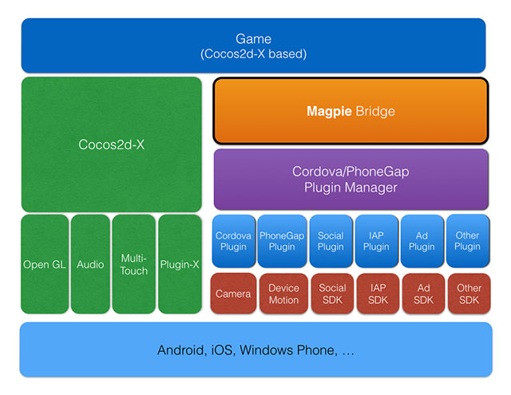

# Magpie = Cocos2d-X + Cordova Plugins #

Framework for Cocos2d-X C++ based game to call hundreds of Cordova/PhoneGap plugins

Taking advantage of both projects:
* Cocos2d-X, the most popular open source game engine. Develop game with C++/javascript/lua, hardware acceleration with OpenGL, excellent performance.
* Cordova, **hundreds of existing plugins** to access native functionalities and 3rd party SDKs.

>Note: it's NOT a plugin for normal Cordova/PhoneGap app, but a plugin framework for Cocos2d-X. 

# Project Status #

* [x] Framework works on Android and iOS.
* [x] Utility CLI magpie.js finished.
* [ ] Documentation and example code.

# Architecture #



# How to Use? #

Requirement: Following tools need be installed first.
* git
* node.js
* cordova

Step 1: Download Magpie Framework and CLI:

```
git clone https://github.com/HandyWit/magpie ~/magpie
```

Step 2: Migrate Cocos2d-X project and add Magpie Framework:

```
~/magpie/cli/magpie.js <cocos2dx_proj_dir> <AppName>
```

> A new project root will be created. 

Step 3: Use Cordova CLI to add Plugins

```
# <cocos2dx_proj_dir>/../../proj_<AppName>
cd <project_root>
cordova plugin add <plugin id or path>
```

Step 4: Write C++ code to call Plugins, build and run.


# Example Code #

This is an example to use C++ to call Cordova AdMob Plugin in Cocos2d-X game.

```c
#if(CC_TARGET_PLATFORM == CC_PLATFORM_ANDROID)
#define BANNER_ADID 		"ca-app-pub-6869992474017983/9375997553"
#define INTERSTITIAL_ADID	"ca-app-pub-6869992474017983/1657046752"
#elif(CC_TARGET_PLATFORM == CC_PLATFORM_IOS)
#define BANNER_ADID 		"ca-app-pub-6869992474017983/4806197152"
#define INTERSTITIAL_ADID	"ca-app-pub-6869992474017983/7563979554"
#endif

bool GameScene::init() {
    if ( ! BaseScene::init() ) {
        return false;
    }

    // create banner
	string args = "";
	args = args + "[{"
		"\"adId\":\"" + BANNER_ADID + "\","
		"\"isTesting\":true,"
		"\"autoShow\":true"
		"}]";
	Magpie::instance()->execute("AdMob", "createBanner", args.c_str(), NULL, NULL);

    return true;
}

void GameScene::onGameStart() {
	string args = "";
	args = args + "[{\"adId\":\"" + INTERSTITIAL_ADID + "\", \"autoShow\":false}]";
	Magpie::instance()->execute("AdMob", "prepareInterstitial", args.c_str(), NULL, NULL);
}

void GameScene::onGameOver() {
	Magpie::instance()->execute("AdMob", "showInterstitial", "[]", NULL, NULL);
}

```

# Why named "Magpie"? #

It comes from the Chinese legend, Magpie Bridge over the the Milky Way, which bring the separated lovers together.


# Credit #

Magpie project is created by Raymond Xie. (floatinghotpot @ github)

It's based on the Cordova/Phonegap Framework.


